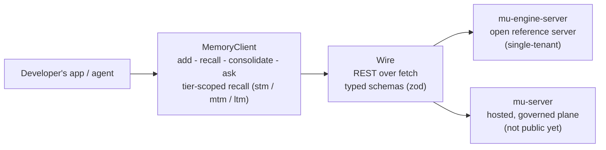

# mu-sdk-js

The JavaScript/TypeScript developer SDK: the same typed memory surface, one idiom over.

Part of [Memory Universe](https://github.com/MemoryUniverse).

**The JavaScript/TypeScript developer SDK for Memory Universe.** The same typed memory surface as
[`mu-sdk-python`](https://github.com/MemoryUniverse/mu-sdk-python), for web, Node, and browser-side
agent developers.

> **Status: early, under active development.** The SDK is built, typed, and tested (unit plus
> integration, run against the same conformance server as the Python SDK, with byte-for-byte
> identical wire payloads). The hosted, governed, multi-tenant plane (`mu-server`) it
> is ultimately aimed at is **not public**. What you *can* point it at today is the open, dockerized
> `mu-engine-server` in [`mu-core`](https://github.com/MemoryUniverse/mu-core). A private beta has
> **not started** — design partners are being recruited for one. See
> [Built vs. designed](#built-vs-designed-read-this-before-you-evaluate-it).

## The vision

Memory Universe is the persistent collaborative session and memory layer for teams of people and
their AI agents — across users, devices, agents, and vendors: context that survives the handoff
between sessions, teammates, machines and vendors, and travels only as far as it was authorized to.
`mu-sdk-js` puts that in reach of the JS/TS ecosystem — Node services, browser agents,
TypeScript-first agent frameworks — with the same verb surface and semantics as the Python SDK, so a
mixed-stack team is not forced to choose one language's memory layer.

## What's in this repo

A thin async wire client, nothing else: no engine, no stores, no strategies. Types are mirrored from
the same language-neutral wire schema `mu-contracts` (Python) defines, validated at runtime with
`zod`, and kept in lock-step with `mu-sdk-python` by a shared conformance test suite rather than by
hand-guessing the Python SDK's shapes. It talks to a Memory Universe server's public surface over
**REST**, using `fetch`, never to the engine directly — this SDK has no in-process mode, unlike its
Python sibling. Wire parity is the claim here, not embedding. Its only runtime dependency is `zod`.

REST is the *only* transport in this repo today. The wider design also gives the SDK an MCP tool
surface and a Centrifugo channel for live push; neither is implemented here — there is no MCP
module, no WebSocket and no `EventSource` anywhere in `src/`. Treat both as designed, not
available.

`MemoryClient` exposes the same verbs as the Python SDK:

| Verb | What it does | Server route today |
|---|---|---|
| `add(content, ...)` | Write a memory (a `PRIVATE` write to the shared endpoint is rejected server-side, mapped to a typed `PrivateDataRejectedError`) | yes |
| `recall(text, ...)` | Multi-channel, tier-scoped (`stm`/`mtm`/`ltm`), persona-aware recall | yes |
| `get(memoryId, ...)` | Fetch one memory by id | yes |
| `consolidate(...)` | Trigger MTM→LTM distillation with invalidate-don't-delete supersession | yes |
| `promote` / `demote` | Move one memory between tiers | yes |
| `update(memoryId, ...)` | Supersede a memory; the old id stays traversable | yes |
| `delete(memoryId, ...)` | Retire a memory | yes |
| `buildContext(text, ...)` | Assemble a context window over recalled memory | yes |
| `search(query, ...)` | Simple ranked-list recall | **not yet** — conformance server only |
| `ask(question, ...)` | Synthesize an answer over recalled context | **not yet** — conformance server only |
| `discover(sessionId)` | Discover the context index for a session | **not yet** — conformance server only |
| `share(memoryId, ...)` | The explicit private→shared crossing | **not yet** — conformance server only; no production route anywhere |

## Quickstart

`mu-sdk-js` is not on npm yet. The name `mu-sdk` is unclaimed on the npm registry (unlike PyPI,
where `mu-sdk` belongs to an unrelated 2016 project — see
[`mu-sdk-python`](https://github.com/MemoryUniverse/mu-sdk-python)'s README), so no rename is
forced here. It has no dependency on the rest of the workspace, so it installs standalone by
either route.

**Route 1 — clone and build:**

```bash
git clone https://github.com/MemoryUniverse/mu-sdk-js
cd mu-sdk-js
npm install
npm run build              # emits dist/index.js — there is no published package to install
```

**Route 2 — install straight from git into your own project:**

```bash
npm install github:MemoryUniverse/mu-sdk-js
```

`dist/` is not committed, so this only works because `package.json` declares
`"prepare": "npm run build"` — npm runs it after cloning a git dependency, which compiles `dist/`
in place. Without that hook the install "succeeds" and leaves you with a package whose only files
are `package.json`, `README.md` and `LICENSE`, and `import { MemoryClient } from "mu-sdk"` fails to
resolve.

The client needs something that speaks the Memory Universe wire contract, and a credential for it.
The shortest real path to both is `mu-core`'s open reference server, which mints a local bearer
token for you:

```bash
git clone -b dev/mlm-build https://github.com/MemoryUniverse/mu-core
cd mu-core/packages/mu-engine-server
make up          # mints ~/.memory-universe/engine-server.token, then brings the stack up on :8300
```

**`-b dev/mlm-build` is not optional.** GitHub's default branch on `mu-core` is `main`, and
`packages/mu-engine-server/` **does not exist on `main`** — a default-branch clone gets you
`cd: no such file or directory` where a server should be. (`main` is stale in the same way for the
Python side: its `mu_contracts.contracts` package is an empty scaffold, so a `main` clone installs
cleanly and then raises `ModuleNotFoundError` on first import. See
[`mu-sdk-python`](https://github.com/MemoryUniverse/mu-sdk-python)'s README.) `dev/mlm-build` is
`mu-core`'s trunk; landing it on `main` is the real fix and is the repository owner's call.

Use `make up`, not a bare `docker compose up`: every route but `/health` is bearer-authenticated,
and `mint-token` is a prerequisite of `up`. Skipping it gets you a healthy server that `401`s
everything.

Then point the SDK at it. `mode: "local_server"` auto-loads that token from disk. If you took
Route 2 above, the bare specifier `"mu-sdk"` resolves and you can `import { MemoryClient } from
"mu-sdk"`. Inside a Route 1 clone there is no registry entry to resolve, so import from the build
output (or `npm link` the package into your project first):

```ts
import { MemoryClient } from "./dist/index.js";

const client = new MemoryClient({
  mode: "local_server",
  endpoint: "http://localhost:8300",
});

await client.add("The staging DB migration runs Tuesdays at 02:00 UTC.");
const result = await client.recall("when does the migration run?");
for (const item of result.items) {
  console.log(item.fused_score, item.content);
}
```

Constructing with a bare `settings: resolveSdkSettings({ baseUrl })` and no credential is the one
shape that does **not** work: `resolveAuth` throws `AuthenticationError` in the constructor, before
any request. That is deliberate (fail loud at construction), but it means `apiKey` or a complete
`identity` is mandatory on that legacy path.

## Built vs. designed: read this before you evaluate it

- **Built and tested today:** the whole client — `fetch` transport, retry/timeout/trace pipeline,
  typed error mapping, zod-validated request and response shapes — exercised by unit tests plus
  `npm run test:integration` against the same real conformance server
  [`mu-sdk-python`](https://github.com/MemoryUniverse/mu-sdk-python) runs against, with payload
  parity between the two SDKs asserted, not assumed. Internal LangGraph demo agents use this client.
- **Runnable today:** the verbs marked *yes* above, against `mu-core`'s open, dockerized
  `mu-engine-server`.
- **Client-side only, for now:** `search`, `ask`, and `discover` are implemented and typed here and
  are served by the conformance server, but no production server route pins them yet. They will
  raise against `mu-engine-server`.
- **Typed here, served by nothing:** `share`, the private→shared crossing. The client method is
  real (`client.ts`, `POST /v1/memories/{id}/share`) and the conformance server answers it, but no
  production server does: `mu-core`'s engine facade raises a named
  `SurfaceVerbNotImplementedError` rather than pretending, and neither `mu-engine-server` nor
  `mu-server` exposes the route. The crossing belongs to `mu-server`, which is not public.
- **Designed, not built in this repo:** the MCP tool surface and the Centrifugo live-push channel.
  The client is REST-only today.
- **Designed, not shipped:** the hosted, governed, multi-tenant plane itself — governed rooms,
  per-fragment provenance, revocable grants, cross-device sync. Nothing in this repo should be read
  as implying it is available.

## Architecture, in one paragraph



`MemoryClient` wraps a `fetch`-based `Transport` behind the same request pipeline as the Python SDK:
trace, an overall timeout generous enough to cover retries, then bounded retry with backoff, so every
verb funnels through one choke-point that maps any non-2xx response to a typed `SdkError` subclass
before retry logic sees it. Request and response shapes are `zod` schemas exported alongside their
inferred TypeScript types, deliberately mirroring `mu-sdk-python`'s pydantic models field for field,
so the two SDKs are provable mirrors of one wire contract rather than two independent
implementations that happen to agree today.

## Where this fits

Part of **Memory Universe**: [github.com/MemoryUniverse](https://github.com/MemoryUniverse).

| Repo | Role |
|---|---|
| [`mu-core`](https://github.com/MemoryUniverse/mu-core) | The open engine: contracts, engine, local facade, reference HTTP server |
| [`mu-client`](https://github.com/MemoryUniverse/mu-client) | The on-device daemon: hook capture for Claude Code and Codex, injection, CLI, MCP |
| [`mu-sdk-python`](https://github.com/MemoryUniverse/mu-sdk-python) | Python developer SDK: typed wire client, plus an in-process embedded mode |
| **mu-sdk-js** (this repo) | JavaScript/TypeScript developer SDK, wire-parity with the Python SDK |
| `mu-server` (private) | The hosted, governed, multi-tenant plane: the commercial part |

## License

Apache-2.0 (see `LICENSE`). Open-core: this SDK, `mu-core`, and `mu-client` are fully open and stay
full-quality on their own. `mu-server`, the hosted, multi-tenant, governed plane, is the commercial
product built on top; it does not exist in this repo and is not required to read or build this code.

## Background

Memory Universe is independent, early-stage work: the productization of about a year of the
founder's graduation-thesis research into multi-user agentic memory. No company and no customers
yet — just an engineer building the open memory layer he believes agent-building teams will need, in
public.

## Contact

- GitHub: [@TRextabat](https://github.com/TRextabat)
- Email: amiramiritabat01@gmail.com

## Links

- Organization: [github.com/MemoryUniverse](https://github.com/MemoryUniverse)
- How it works, in six diagrams: [Memory Universe Mechanics](https://claude.ai/code/artifact/4127edfb-bd56-462b-9cb5-2f5d3ea4e3c4)
- Issues / discussion: use this repo's GitHub Issues
- License: [Apache-2.0](./LICENSE)
