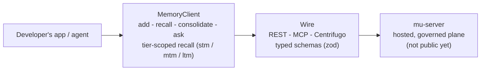

# mu-sdk-js

**The JavaScript/TypeScript developer SDK for Memory Universe.** The same typed memory surface as
`mu-sdk-python`, for web, Node, and browser-side agent developers.

> **Status: early, under active development (private beta in progress).** The SDK is built, typed,
> and tested (unit + integration, run against the same conformance server as the Python SDK, with
> byte-for-byte identical wire payloads). What it talks to, `mu-server`, the hosted, governed,
> multi-tenant plane, is designed but **not yet publicly available**. See [Honest note on what you
> can run today](#honest-note-on-what-you-can-run-today).

## The vision

Memory Universe is a persistent, governed context layer for teams of people and their AI agents:
context that survives across sessions, teammates, machines, and agent vendors, and travels only as
far as it was authorized to. `mu-sdk-js` puts that in reach of the JS/TS ecosystem: Node services,
browser agents, and TypeScript-first agent frameworks, with the exact same verb surface and
semantics as the Python SDK, so a mixed-stack team isn't stuck choosing one language's memory layer.

## What's in this repo

A thin async wire client, nothing else: no engine, no stores, no strategies. Types are mirrored
from the same language-neutral wire schema `mu-contracts` (Python) defines, validated at runtime
with `zod`, and kept in lock-step with `mu-sdk-python` by a shared conformance test suite, not by
hand-guessing the Python SDK's shapes. It talks to `mu-server`'s public surface only, through REST,
MCP, and Centrifugo for live push (SSE / WebSocket-compatible transport), never to the engine
directly.

`MemoryClient` exposes the same verbs as the Python SDK:

| Verb | What it does |
|---|---|
| `add(content, ...)` | Write a memory (a `PRIVATE` write to the shared endpoint is rejected server-side, mapped to a typed `PrivateDataRejectedError`) |
| `search(query, ...)` | Simple ranked-list recall |
| `recall(text, ...)` | Multi-channel, tier-scoped (`stm`/`mtm`/`ltm`), persona-aware recall |
| `consolidate(...)` | Trigger MTM→LTM distillation with invalidate-don't-delete supersession |
| `ask(question, ...)` | Synthesize an answer over recalled context |
| `context.discover(sessionId)` | Discover the context index for a session |

## Quickstart

`mu-sdk-js` isn't on npm yet (the package name will be `mu-sdk`). It has no dependency on the rest
of the monorepo beyond `zod`, so it builds standalone:

```bash
git clone https://github.com/MemoryUniverse/mu-sdk-js
cd mu-sdk-js
npm install
npm run build
```

```ts
import { MemoryClient, resolveSdkSettings } from "mu-sdk";

const client = new MemoryClient({
  settings: resolveSdkSettings({ baseUrl: "http://localhost:8000" }),
});

await client.add("The staging DB migration runs Tuesdays at 02:00 UTC.");
const result = await client.recall("when does the migration run?");
for (const item of result.items) {
  console.log(item.score, item.content);
}
```

### Honest note on what you can run today

`baseUrl` above needs to point at something speaking `mu-server`'s wire contract, and the public,
hosted `mu-server` isn't open yet; that's the part of Memory Universe still in private beta. What
exists today: a real conformance HTTP server (the same one `mu-sdk-python` is tested against;
`npm run test:integration` runs this SDK against it directly, and payload parity between the two
SDKs is asserted, not assumed), plus internal LangGraph demo agents built with this client against a
local reference server backed by `mu-core`'s open engine. To use `mu-sdk-js` for real today, run
your own server implementing the same contract, or wait for the hosted plane's private beta.

## Architecture, in one paragraph



`MemoryClient` wraps a `fetch`-based `Transport` behind the same request pipeline as the Python SDK:
trace, an overall timeout generous enough to cover retries, then bounded retry with backoff, so
every verb funnels through one choke-point that maps any non-2xx response to a typed `SdkError`
subclass before retry logic sees it. Request/response shapes are `zod` schemas exported alongside
their inferred TypeScript types, deliberately mirroring `mu-sdk-python`'s pydantic models field for
field, so the two SDKs are provable mirrors of one wire contract rather than two independent
implementations that happen to agree today.

## License

Apache-2.0 (see `LICENSE`). Open-core: this SDK, `mu-core`, and `mu-client` are fully open and stay
full-quality on their own. `mu-server`, the hosted, multi-tenant, governed plane this SDK talks to,
is the commercial product built on top; it doesn't exist in this repo and isn't required to read
or build this code.

## Background

Memory Universe is independent, early-stage work: the productization of about a year of the
founder's graduation-thesis research into multi-user agentic memory. No company and no customers
yet. Just an engineer building the open memory layer he believes agent-building teams will need, in
public.

## Contact

- GitHub: [@TRextabat](https://github.com/TRextabat)
- Email: amiramiritabat01@gmail.com

## Links

- Organization: [github.com/MemoryUniverse](https://github.com/MemoryUniverse)
- Sibling repos: [`mu-core`](https://github.com/MemoryUniverse/mu-core) ·
  [`mu-client`](https://github.com/MemoryUniverse/mu-client) ·
  [`mu-sdk-python`](https://github.com/MemoryUniverse/mu-sdk-python) (Python, feature parity)
- Issues / discussion: use this repo's GitHub Issues
- License: [Apache-2.0](./LICENSE)
